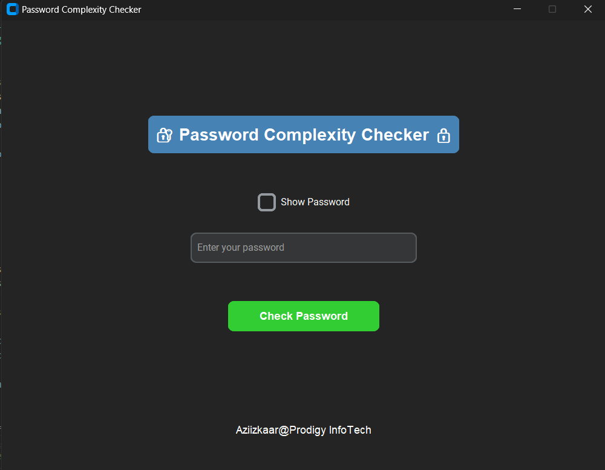

# PassCheck

## Introduction
a simple GUI application that takes passwords from users and gives feedback on the strength of the password keyed in.
The app follows the conventional way of classifying passwords as strong or weak.

## App Interface

## Relevance of the application in cyber security

The application provides feedback on users’ passwords so that the users can make necessary changes to avoid the compromise of personal accounts. Passwords are considered the first line of defense in Cyber Security, weaker ones can be easily identified by Brute Force and other automated attacks.
 
 
 ## Key Features 🔑 :
 1: Password Complexity Checking: The app checks if the password entered by the user meets specific complexity criteria:

 2:  Password Visibility Toggle: The app includes a checkbox to toggle password visibility. When checked, the password is displayed in plain text. When unchecked, the password is hidden with asterisks (*).

 3: User Feedback with Messagebox: After the user clicks the "Check Password" button. The app provides feedback on whether the password meets the requirements.

 4: Empty Password Handling: If the password field is empty or contains only spaces, the app will show a warning message asking the user to enter a password.
